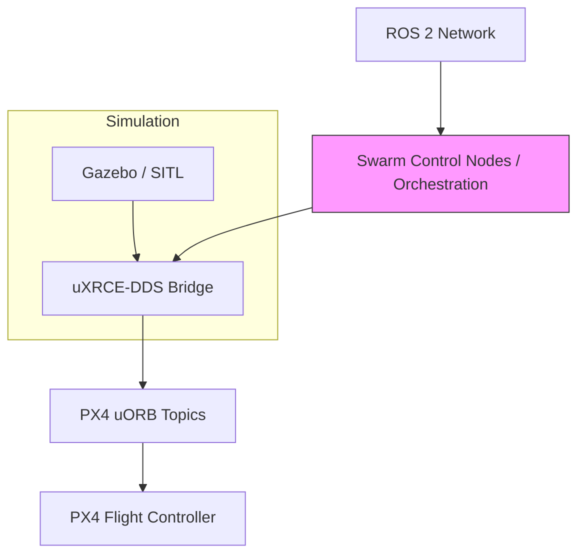

Autonomous multi-drone coordination is among the most challenging areas in modern robotics. This project develops a simulation environment focused on synchronized precision landing for swarm drones using PX4, ROS 2, and Gazebo.

**Project objective**

Explore safe, synchronized landing procedures for multiple UAVs while maintaining communication stability, timing consistency, and scalable behavior management.

**System overview**

**Key components**

- PX4 Autopilot: low-level control, stabilization, and safety.
- ROS 2: distributed communication, synchronization topics, and higher-level coordination.
- MAVLink / MAVSDK: telemetry, mission upload, and ground-control interoperability.
- Gazebo (SITL): physics-based multi-drone testing and sensor simulation.

**Behavior orchestration**

Swarm behavior management in this project draws inspiration from frameworks such as FlexBE and Aerostack but remains implementation-specific. Core concepts used:

- Hierarchical task execution and state machines
- Event-driven transitions and coordination
- Decentralized timing synchronization for landing windows

**Communication & concurrency patterns**

- Each agent continuously publishes position, status, and landing readiness.
- ROS 2 QoS and DDS are tuned for reliable, low-latency exchange across agents.
- Asynchronous patterns (Python `asyncio`, ROS 2 callbacks, MAVSDK async API) reduce blocking and improve responsiveness.



This video demonstrates the multi-agent synchronization and SITL integration used during testing.

**Synchronization strategy (bulleted modules)**

- Time-windowed landing: coordinator assigns landing windows to reduce collision risk.
- Heartbeat & readiness: drones publish health and landing readiness topics.
- Conflict resolution: simple priority scheme with fallback safe-hold behavior.
- Recovery: automatic abort-to-hold on sensor failure or communication loss.

**Simulation environment**

- Multi-drone spawning and per-agent sensors in Gazebo.
- Centralized recorder for telemetry playback and CI regression tests.
- Scripts to automate spawning, mission scripts, and coordinated landing trials.

**Current goals & roadmap**

- Stable synchronized landing and timing consistency across agents.
- Robust state management and communication pipeline optimization.
- Future: vision-based fiducial landing, fully decentralized swarm decision-making, edge-AI integration.

**Tech stack**

- PX4, ROS 2, Gazebo, MAVLink/MAVSDK
- Python (asyncio), ROS 2 rclpy

**References & resources**

- PX4 docs: https://docs.px4.io
- ROS 2 docs: https://docs.ros.org
- MAVSDK: https://mavsdk.mavlink.io
- FlexBE: https://github.com/FlexBE
- Aerostack: https://github.com/aerostack2
- Gazebo: https://gazebosim.org

**Notes on images & assets**

Place your provided hero image in `content/blog/Swarm-Drone/swarm-hero.jpg` to appear as the post hero. I used `swarm-hero.jpg` in front matter — rename or copy your attached image accordingly.

---

If you want, I can add a static Mermaid PNG snapshot, or place the attached hero image into the folder for you (I will not commit). After you commit, tell me and I'll run the Hugo build to generate the preview HTML.