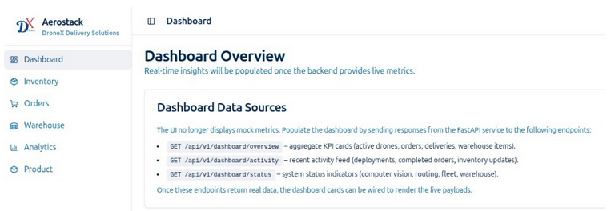
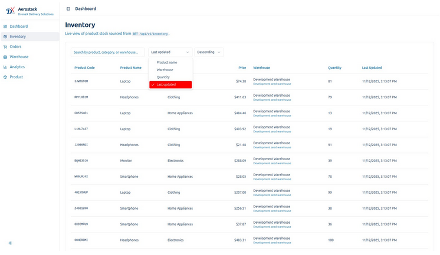
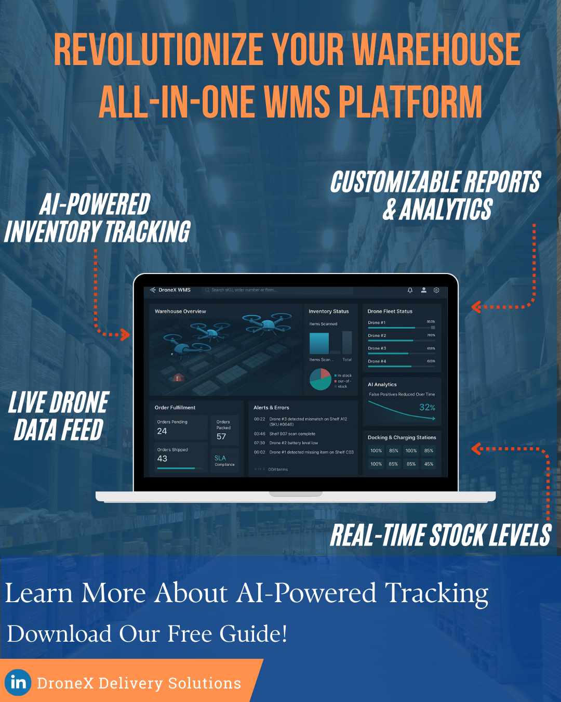

Aerostack WMS is a warehouse management platform designed for facilities that want to connect inventory operations with autonomous drone workflows. It brings warehouse status, mission planning, route optimization, and digital twin context into one operational interface.

The system is built for teams that need more than a static inventory dashboard. Aerostack WMS supports fast decision-making across warehouse supervisors, robotics engineers, and operations teams by keeping inventory state, mission progress, and facility constraints visible in real time.

## Operational Focus

- **Inventory-aware mission planning:** Plan drone inspection routes around racks, aisles, restricted zones, and priority inventory areas.
- **Digital twin setup:** Model the warehouse layout so autonomous missions can be configured, tested, and improved before live deployment.
- **Route optimization:** Reduce travel time and repeated coverage by adapting routes to facility geometry and operational priorities.
- **Management dashboard:** Give teams a practical view of inventory tasks, mission health, and warehouse performance indicators.

## Where It Fits

Aerostack WMS is suited for warehouse operators exploring autonomous inventory checks, robotics teams building drone-based inspection workflows, and companies that need a bridge between warehouse management software and field robotics.

## Delivery Scope

DroneX can support the full workflow from proof of concept to pilot deployment, including dashboard design, autonomy integration, digital twin configuration, and warehouse-specific data pipelines.

<video controls width="100%" style="border-radius: 8px; margin-top: 1rem;">
  <source src="demo.mp4" type="video/mp4">
  Your browser does not support the video tag.
</video>
