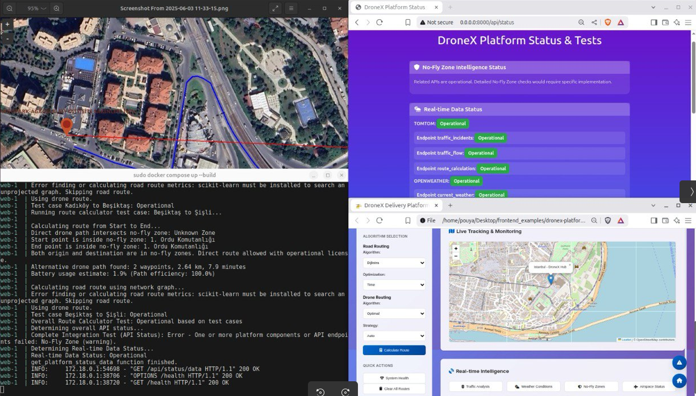
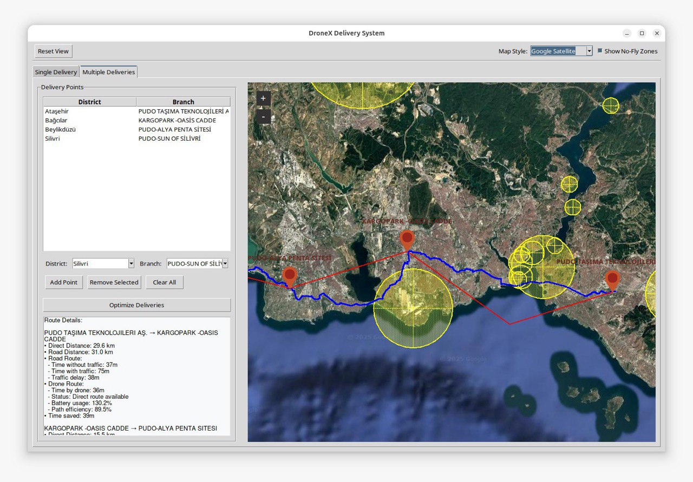

The UTM Delivery Platform is a web-based system for managing drone delivery operations. It combines live map visibility, operator information, order planning, no-fly-zone awareness, and authentication workflows into a single control interface.

## Operational Focus

- **Live fleet monitoring:** Display drone locations, mission state, and operator-relevant telemetry on a real-time map.
- **Order planning:** Support delivery task creation, route review, dispatch preparation, and mission tracking.
- **Airspace constraints:** Visualize no-fly zones and operational boundaries so planners can avoid restricted areas.
- **Operator workflow:** Provide structured login, user context, and control panels for day-to-day delivery management.

## Where It Fits

The platform is designed for teams exploring drone delivery pilots, campus logistics, controlled-site delivery, or research programs that need a practical operational layer above vehicle-level autonomy.

## Delivery Scope

DroneX can support map interface design, fleet state services, delivery workflow development, UTM data integration, authentication, and deployment architecture.

<video controls width="100%" style="border-radius: 8px; margin-top: 1rem;">
  <source src="demo.webm" type="video/webm">
  Your browser does not support the video tag.
</video>
